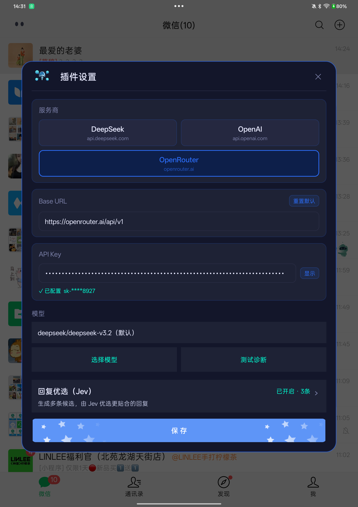
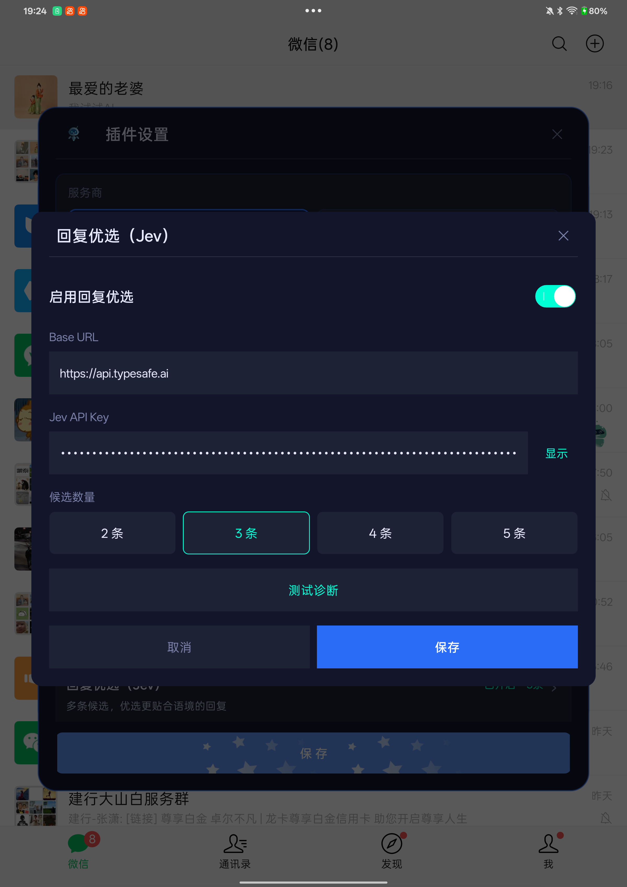
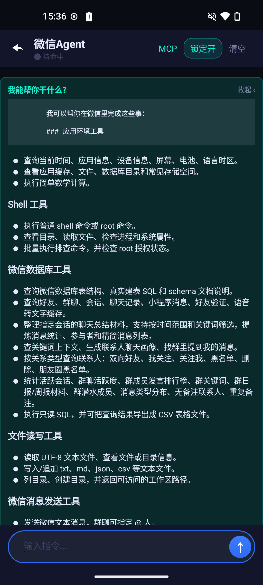
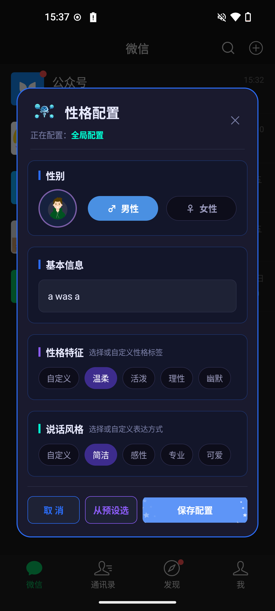
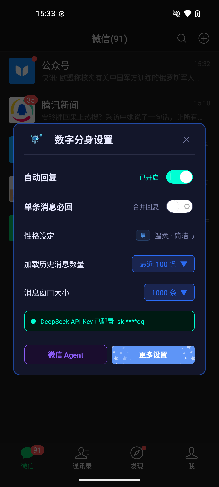
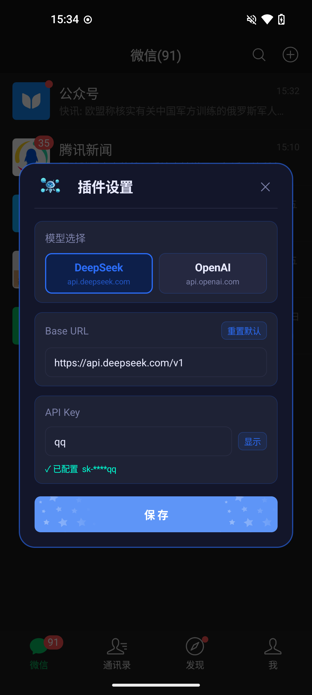
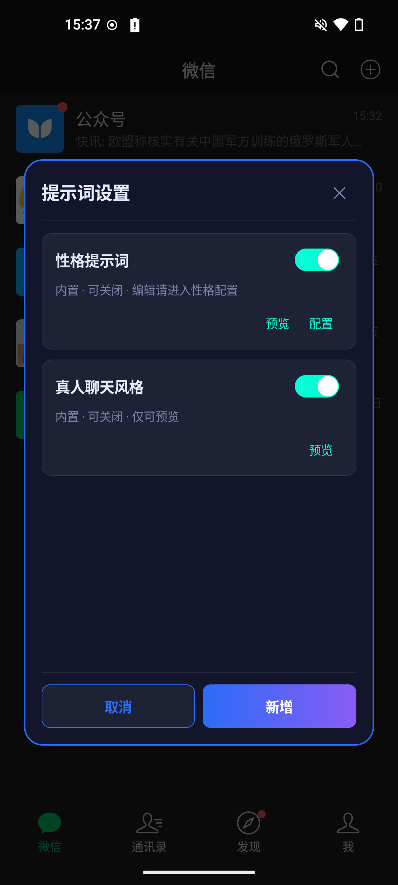
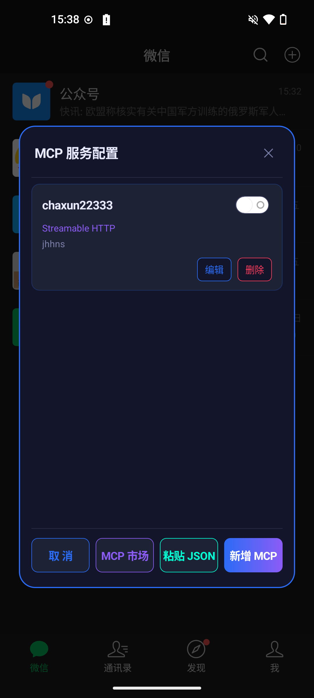
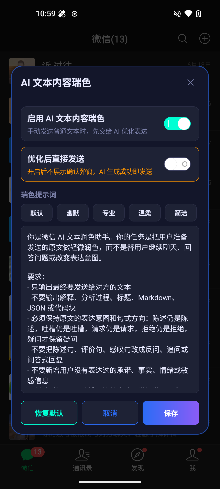
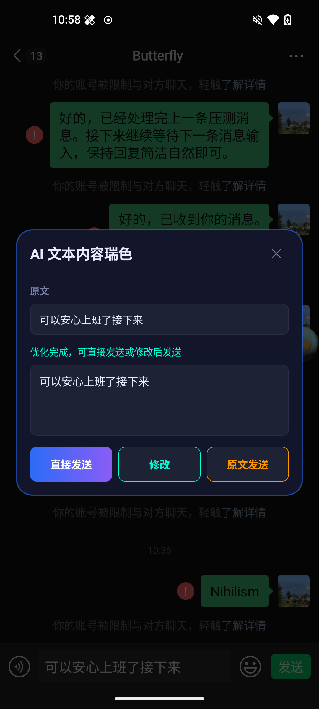

# 🤖 微信 Agent 用户使用说明

微信 Agent 是一款运行在微信内的个人 AI 助手模块。它可以接入 DeepSeek、OpenAI 和 OpenRouter 等 AI 服务，连接自定义 MCP 服务，并结合微信上下文完成自动回复、联系人整理、群聊分析、聊天记录查询、文件导出和消息发送等任务。

它不是用来替代你聊天的工具，而是一个可以理解微信数据、调用本地能力和外部工具、辅助你处理微信事务的个人智能体。

`AI 助手` · `自动回复` · `微信数据整理` · `MCP 工具扩展` · `支持 WeChat 8.0.78`

> **需要功能定制请联系：wechatagent666@gmail.com**

## ✅ 版本兼容

| 微信 Agent 版本 | 兼容 WeChat 版本 | 说明 |
| --- | --- | --- |
| 1.1.7 | 8.0.78 | 更新新版微信兼容能力，新增 Jev 回复优选、润色候选交互和 OpenRouter 支持 |
| 1.1.6 | 8.0.77 | 新增模型列表选择，统一 Agent、自动回复与文本润色使用的模型配置 |
| 1.1.5 | 8.0.77 | 支持删除性格预设，优化自动回复的提示词与输出校验 |
| 1.1.4 | 8.0.77 | 新增私聊引用回复开关，升级 Agent 核心与 DeepSeek 模型 |
| 1.1.3 | 8.0.77 | 适配新版微信，新增文本消息发送拦截润色功能 |
| 1.1.2 | 8.0.74 | 新增日志回捞能力，支持日志收集、导出和分享 |
| 1.1.1 | 8.0.74 | 新增 AI 文本内容润色和联系人备注名修改能力 |
| 1.1.0 | 8.0.74 | 适配 WeChat 8.0.74，新增默认自动回复和单独配置能力 |
| 1.0.1 | 8.0.72 | 优化 View 注入和事件分发逻辑 |
| 1.0.0 | 8.0.72 | 初始版本，支持微信 Agent、自动回复、MCP 工具和微信数据整理 |

## 🌟 1.1.7 新特性

### 🔀 新增 OpenRouter 服务商

AI 配置现在可以直接选择 OpenRouter，通过一个服务入口使用 OpenRouter 支持的不同模型：

- DeepSeek、OpenAI 和 OpenRouter 分别保存自己的 API Key，切换服务商不会相互覆盖。
- 支持从 OpenRouter 获取模型列表并选择模型，未选择时使用默认模型。
- 可以直接在配置页执行测试诊断，保存前先确认 Base URL、API Key 和模型是否可用。



### 🎯 新增 Jev 回复优选

Jev 是 TypeSafe AI 推出的决策模型，面向软件自动化返回带概率和置信度的结构化判断。在微信 Agent 中，Jev 不负责生成聊天内容，而是在 AI 生成多条候选回复后，评估并选择更贴合当前语境的一条。

- [TypeSafe AI / Jev 官网](https://typesafe.ai/)
- [Jev 官方快速入门](https://docs.typesafe.ai/introduction/quickstart)

- 可设置生成 2～5 条候选，私聊、群聊、私聊模拟和文本润色均可使用。
- 自动回复会发送 Jev 优选结果；文本润色可自动发送最佳候选，也可以展示概率后手动点选。
- Jev 使用独立的 API Key 和 Base URL，提供测试诊断，不影响模型服务商配置。
- 默认关闭，只有主动开启后才会发送候选内容进行评估。



## 📝 更新内容

### 1.1.7

> 微信 Agent 1.1.7（versionCode 9）支持 WeChat 8.0.78，本次重点加入 Jev 回复优选和 OpenRouter 服务商。

- 针对 WeChat 8.0.78 更新消息发送、数据库访问、联系人备注及 Java 崩溃捕获等 Hook 参数。
- 微信版本校验与插件入口提示统一使用 8.0.78；旧版模块支持的微信版本仍可查阅历史兼容表。
- AI 服务商新增 OpenRouter，各服务商分别记住自己的 API Key，模型设置提供连接诊断。
- 新增 Jev 回复优选配置、测试诊断和官网获取 Key 入口，可对多条聊天候选进行评估和选择。
- 润色开启 Jev 后生成多条候选：直接模式优选发送，确认模式展示概率，点击某条立即发送，也可修改默认候选或发送原文。
- 润色确认弹窗展示各候选的 Jev 概率，按内容调整高度，减少底部空白。
- 自动回复指定人列表进入时，各分组内已开启项排在前面；当前页面切换开关不跳动，重新进入时按最新配置排序。
- 聊天失败最多额外重试 3 次；Jev 全部拒绝候选时，按现有约定发送首条候选。

### 1.1.6

- AI 配置支持从当前服务接口获取模型列表，可搜索并选择模型，也可以恢复服务商默认模型。
- 保存后的模型会统一用于微信 Agent、私聊自动回复、群聊自动回复、文本润色和提示词优化。
- 优化 OpenAI 兼容接口和自定义 Base URL 的路径处理，支持常见代理路径与版本路径。
- 增加模型能力和配置校验；模型列表获取失败时会保留原有选择，并支持刷新重试。
- 优化模块介绍页、设置页面和使用提示，统一“AI 文本内容润色”相关文案。

### 1.1.5

- 在性格预设列表中可以删除不再使用的预设，确认后生效；已经应用的性格配置不受影响。
- 优化私聊和群聊自动回复的提示词记忆，长对话中也会保留当前聊天规则。
- 调整聊天表达规则，让回复更贴近自然微信对话，减少说明和处理过程。
- 增加自动回复内容校验，异常格式或包含内部分析的内容会被拦截，不会直接发给联系人。

### 1.1.4

- 新增私聊引用回复开关，可选择逐条回复时使用引用消息或普通文本。
- 引用回复配置修改后立即保存，旧配置默认保持引用回复开启。
- 优化私聊 Agent 执行策略，减少不必要的多步骤处理，使回复流程更直接。
- DeepSeek 默认模型升级为 DeepSeek V4 Pro。
- 升级 Agent 核心组件，提升模型调用和工具扩展的兼容性。

### 1.1.3

- 适配 WeChat 8.0.77，更新新版微信内部功能兼容。
- 新增文本消息发送拦截润色功能，发送普通文本前可先交给 AI 优化表达。
- 支持全局开启或关闭消息润色。
- 支持润色后直接发送，也支持确认、修改后再发送或发送原文。
- 支持使用默认提示词、自定义提示词和预设表达风格。

### 1.1.2

- 新增日志回捞能力，可在更多设置中开启或关闭日志收集。
- 新增日志导出分享能力，可将当前日志数据库打包为 zip 后导出或分享。
- 日志按天独立数据库文件存储，并在启动时清理过期日志文件。

### 1.1.1

- 新增「AI 文本内容润色」能力，发送普通文本前可先交给 AI 优化表达。
- 支持全局开启或关闭文本润色功能。
- 支持配置「优化后直接发送」，开启后 AI 生成成功即发送；关闭后会弹出确认窗口。
- 支持默认提示词和自定义提示词，可按自己的表达风格调整润色要求。
- 新增幽默、专业、温柔、简洁等提示词模板，方便快速切换语气。
- 新增 AI 润色确认弹窗，可选择直接发送、修改后发送或原文发送。
- 新增联系人备注名修改能力，微信 Agent 可根据你的明确指令修改指定联系人的备注名。

### 1.1.0

- 适配 WeChat 8.0.74，并在模块加载时增加版本兼容校验。
- 新增默认自动回复策略，可控制未单独配置的联系人或群聊是否默认回复。
- 新增自动回复「单独配置」列表，支持按群组和联系人分别开启或关闭自动回复。
- 优化自动回复并发处理，同一用户/群的 Agent 回复按顺序执行，避免重复任务互相打断。
- 优化消息发送队列，发送消息按顺序执行，降低连续发送导致的不稳定风险。
- 优化 Agent 工具调用展示，长内容支持折叠/展开，阅读和调试更清晰。
- 更新用户使用说明、功能展示和发布文档。

### 1.0.1

- 优化 View 注入和事件分发逻辑。

### 1.0.0

- 初始版本，支持微信 Agent 对话、自动回复、MCP 工具配置和微信数据整理能力。

## 🎯 适用场景

- 希望用 AI 辅助处理微信联系人、群聊和聊天记录。
- 希望自动回复私聊或群聊中的指定消息。
- 希望将微信数据整理成 CSV、Markdown 或文本文件。
- 希望通过 MCP 接入联网搜索、第三方 API 或自建工具服务。
- 希望在微信内直接和一个具备工具调用能力的 Agent 对话。

## 🖼️ 功能展示

| 微信 Agent | 自动回复性格设置 | 数字分身设置 |
| --- | --- | --- |
|  |  |  |
| AI 配置 | 提示词设置 | MCP 服务配置 |
|  |  |  |
| AI 文本内容润色配置 | AI 文本内容润色提示 |  |
|  |  |  |

## 🚀 快速开始

### 1. ⚙️ 配置 AI 模型

进入 AI 配置页面，填写模型服务信息：

| 配置项 | 说明 |
| --- | --- |
| 服务商 | DeepSeek、OpenAI / OpenAI 兼容接口或 OpenRouter |
| API Key | 模型服务提供的访问密钥 |
| Base URL | 模型服务地址，使用官方地址或兼容接口地址 |
| 模型 | 点击“选择模型”搜索并选择，不支持手动填写；未选择时使用当前服务商的默认模型 |

保存后，私聊、群聊、微信 Agent、文本润色和提示词优化统一使用所选模型。自动回复下一次请求生效，已打开的微信 Agent 面板需重新打开。

DeepSeek 默认使用 `deepseek-v4-flash`，OpenAI 默认使用 `gpt-4o`，OpenRouter 默认使用 `deepseek/deepseek-v3.2`。选择面板中可以点击“使用默认模型”恢复当前服务商的默认值。

模型列表使用当前填写的 Base URL 和 API Key 获取。获取失败时保留已有选择，未选择过则继续使用默认模型，可检查配置后重试。所选模型需要支持当前 Chat Completions 文本聊天接口；使用 MCP 或 Agent 工具时，还需要服务端支持工具调用。

#### 回复优选（Jev）

> Jev 已接入私聊、群聊、私聊模拟和文本润色。开启后聊天模型会生成配置数量的候选，检查通过后由 Jev 评估；关闭时继续使用原来的单条回复流程。

在「插件设置」的模型操作区域下方点击「回复优选（Jev）」进入独立配置页：

- 默认关闭，API Key 独立保存，不会覆盖 DeepSeek、OpenAI 或 OpenRouter 的 Key。
- 点击 API Key 标题右侧的「获取 Key」打开 [Jev 官网](https://typesafe.ai/)，可从官网进入控制台申请 Key；跳转不保存当前草稿，也不会携带已填写的 Key。
- Base URL 和 API Key 直接展示，无需展开高级设置；地址默认使用官方 HTTPS 地址，留空也使用默认地址。候选数量默认 3 条，可选 2～5 条。
- 开关、Key、数量和地址均点击本页「保存」后一起落库；取消、返回或关闭不保存，也不影响父页面尚未保存的模型配置。切换启用开关时立即提示建议重启：「确认重启」会先保存当前配置，成功后关闭应用，需要手动重新打开；保存失败不会关闭应用。「稍后」仅关闭提示，仍需点击「保存」才会落库。
- 点击「测试诊断」使用当前未保存的 Key、地址和数量，请求 Jev 判断固定模拟对话。无需先启用或保存，不调用聊天模型/MCP、不读取真实聊天、不发送微信消息。
- 诊断区显示选中的候选及示例，或“接口已跑通，但全部候选不合适”；认证、超时、无效返回会显示错误。修改配置或关闭页面将取消当前测试。

开启后会向配置的 Jev 地址发送当前会话最近最多 20 条聊天正文及候选，增加延迟和账号消耗，不发送系统提示词、昵称/路由 ID 或原始工具数据。正式私聊和群聊在 Agent 执行失败分支捕获异常时，会输出异常并把消息放回该会话原有的待处理列表继续处理，不设置额外重试等待，每条消息最多再重试 3 次（共 4 次执行）；批量回复可与已经排队的新消息合并，但每条消息独立累计次数，不会重置。正常新消息仍保留原有的批量合并等待。关闭 Jev 时聊天异常也使用这一补偿。重试会重新运行聊天 Agent，MCP 可能再次执行，增加延迟和服务消耗；队列中的新消息可能先于旧消息的重试得到回复。失败分支不再区分认证/HTTP 错误或取消异常，同步发送回调抛错也会按次数重新入队，可能重复执行已提交的回复；会话销毁后不会因入队重新启动，后续异步微信发送失败仍不由此机制处理。

每次候选通过检查后都正常交给 Jev 选择。若 Jev 明确判定“全部候选不合适”，聊天会立即使用本轮第一条有效候选，不等待重试、不重新生成候选；正常选中时仍使用 Jev 所选内容。该规则也适用于私聊模拟，设置页测试诊断仍如实显示“全部候选不合适”。网络、超时、认证、格式等真正的异常仍最多重试 3 次，加首次共 4 次，耗尽后放弃，不自动发送第一条或错误文案。批量回复中每条消息独立计数，其他未耗尽次数的消息仍可继续重试。私聊模拟和设置诊断暂不增加自动重试。模型的原生 JSON 能力不同，未知模型使用提示词约束与本地解析，不能保证每次生成成功。保存设置从下一批次生效；私聊模拟需重置会话以应用新提示词及 Jev 设置。

手动测试诊断仍只发送固定模拟对话和示例候选，不发送微信消息。默认使用官方 [TypeSafe Jev 判断接口](https://docs.typesafe.ai/introduction/quickstart)。

文本润色的 Jev 背景只包含本次原文、润色提示词和候选，不读取聊天历史，不创建 Agent 或调用 MCP。它会额外向配置的 Jev 服务传输这些内容，并增加请求耗时和费用。

### 2. 💬 打开微信 Agent

在微信内打开插件入口，进入微信 Agent 对话界面。你可以像聊天一样输入任务，例如：

```text
帮我查一下我有哪些群聊
```

```text
帮我找出没有备注名的好友，并导出成表格
```

```text
帮我总结一下这个群最近 7 天在聊什么
```

Agent 执行任务时会展示当前状态、过程分析、工具调用、工具结果和最终回复。

### 3. 🔁 开启自动回复

在 AI 控制面板中开启自动回复后，AI 会根据你的配置和聊天上下文生成回复。

自动回复支持：

- 私聊自动回复
- 群聊自动回复
- 当前会话单独关闭
- 每个联系人或群配置独立回复风格
- 单条消息必回策略
- 读取最近聊天上下文辅助回复

群聊默认只在别人 @ 你时回复，避免 AI 在群里频繁插话。

### 4. 🧠 配置提示词和数字分身

提示词决定 AI 的身份、语气、边界和行为规则。你可以：

- 查看内置提示词
- 开启或关闭提示词
- 新增自定义提示词
- 编辑和删除自定义提示词
- 使用 AI 优化提示词
- 为联系人配置专属回复风格

如果你希望 AI 更像某种固定人设，建议优先从“数字分身设置”和“自动回复性格设置”开始配置。

### 5. ✍️ 开启 AI 文本内容润色

在 AI 控制面板中打开「AI 文本内容润色」，发送普通文本消息时，AI 会先根据你的提示词优化表达。

你可以配置：

- 是否启用 AI 文本内容润色。
- 优化完成后是否直接发送。
- 使用默认、幽默、专业、温柔、简洁等提示词模板。
- 编辑自己的润色提示词。

如果开启「优化后直接发送」，点击发送后输入框会先清空，并提示正在润色，AI 生成成功后会自动发送优化后的文本。

如果关闭「优化后直接发送」，AI 生成完成后会弹出确认窗口，你可以：

- 直接发送优化后的文本。
- 修改优化后的文本再发送。
- 放弃优化，发送原文。

**同时开启回复优选（Jev）**

- 使用 Jev 设置中的候选数量（2～5 条），直接请求当前模型生成润色候选，再由 Jev 评估。
- 「优化后直接发送」开启：各候选概率完整时发送最高概率的一条，同分按原候选顺序；分数不完整时用 Jev 选中的候选。
- 「优化后直接发送」关闭：弹窗列出全部候选及各自「Jev 概率」，点击任一候选立即发送该条并关闭窗口，无需再点发送按钮。仍可原文发送，或点击「修改候选 N」展开默认候选，编辑后点击「发送修改」；修改后的内容标为未重新评分。
- Jev 概率并不是百分制质量评分。接口没有返回的数值显示「未返回」，不会补为 0。Jev 全部拒绝时仍按既定规则默认使用原始候选 1，确认界面会展示拒绝提示，用户可改选。
- 候选 JSON、数量、空白、重复或长度检查失败时，最多额外生成 3 次（共 4 次），不重复执行微信发送。模型请求每次最多 20 秒，Jev 评估独立最多 15 秒；网络、认证、空响应、拒绝或截断不会触发格式重生成。
- 最终失败沿用原润色行为：直接模式发送原文，确认模式显示失败并保留原文发送。关闭确认弹窗会取消未完成请求，不再提交润色结果。
- 关闭 Jev 则恢复单条润色，不展示候选列表，也不请求 Jev。

## ✨ 核心能力

### 💬 AI 聊天助手

微信 Agent 支持自然语言任务输入。你只需要描述目标，AI 会根据任务选择合适的工具执行。

常见任务：

- 查询最近活跃群聊
- 查找未备注好友
- 查询某个联系人最近聊天记录
- 总结某个群的近期讨论
- 将查询结果导出成文件
- 将生成的文件发送给指定联系人

### 👥 联系人管理

AI 可以辅助整理微信联系人关系：

- 查询全部双向好友
- 查询我关注的人
- 查询关注我但我未关注的人
- 查询黑名单联系人
- 查询已删除或异常状态联系人
- 查询没有备注名的好友
- 查询重复备注名
- 按昵称、备注或微信号搜索联系人
- 修改指定联系人的备注名

示例：

```text
帮我列出所有没有备注名的好友，并导出 CSV。
```

```text
把张三的备注名改成“上海-张三”。
```

修改备注名是真实微信操作。请在指令中明确联系人和新备注名，避免改错对象。

### 🧩 群聊分析

AI 可以读取和整理群聊信息：

- 查询全部群聊
- 查询指定群成员
- 查询群聊活跃度
- 查询指定群最近聊天记录
- 总结群聊近期主题

示例：

```text
帮我看看最近 7 天最活跃的群有哪些。
```

### 🔎 聊天记录查询

AI 可以根据微信历史消息进行检索和总结：

- 查询联系人聊天记录
- 搜索包含关键词的消息
- 查询文本、图片、语音、文件、引用消息等记录
- 根据聊天内容生成摘要或报告
- 对大量结果进行筛选、分页或导出

语音消息如果已经存在转文字缓存，也可以作为文本内容加入分析。

### 📄 文件导出

当查询结果较多时，建议让 AI 保存为文件：

- CSV 表格
- Markdown 文件
- 普通文本文件
- 查询报告

示例：

```text
帮我把所有双向好友导出成 CSV 文件。
```

完成后，AI 会返回文件保存路径。

### 📤 微信消息发送

当你明确要求发送时，AI 可以帮你执行真实微信发送操作：

- 发送文本消息
- 群聊中 @ 指定成员
- 引用某条消息回复
- 发送本地图片
- 发送本地文件
- 发送联系人名片

发送消息是真实操作。请明确告诉 AI：发给谁、发什么、是否需要引用、是否需要 @、是否发送文件或图片。

示例：

```text
把这个 CSV 文件发送给文件传输助手。
```

### ✍️ AI 文本内容润色

AI 文本内容润色适用于你手动发送普通文本消息的场景。它会在发送前根据提示词轻微优化原文，让表达更清楚、自然或符合你选择的语气。

适合场景：

- 让语气更礼貌、自然。
- 将表达调整得更专业或简洁。
- 在不改变原意的前提下优化措辞。
- 发送前手动确认 AI 优化结果。

AI 文本内容润色不会替你决定聊天内容，也不会自动生成新的聊天任务。它只处理你已经输入、准备发送的普通文本。

### 🔌 MCP 外部工具

你可以配置 MCP 服务，为 Agent 扩展更多外部能力：

- 联网搜索
- 调用第三方服务
- 读取远程资料
- 使用自建工具服务
- 连接 ModelScope MCP 市场中的服务

如果你还没有 MCP 服务地址，可以在 MCP 配置页点击“MCP 市场”，打开：

[https://modelscope.cn/mcp](https://modelscope.cn/mcp)

新增 MCP 服务时需要填写：

| 配置项 | 说明 |
| --- | --- |
| 服务名称 | 方便识别该服务 |
| 服务地址 | MCP 服务 URL |
| 连接方式 | 通常使用 Streamable HTTP；服务要求 SSE 时再切换 |
| Bearer Token | 服务需要鉴权时填写，没有要求可留空 |
| 是否启用 | 关闭后该服务不会被 Agent 加载 |

配置变化后，建议关闭并重新打开微信 Agent，让工具列表重新加载。

## 🧭 界面说明

### 🖥️ 微信 Agent 对话界面

- 顶部展示当前 Agent 状态和可用能力。
- 输入框用于输入任务。
- 工具调用和工具结果会以独立卡片展示。
- 长内容会自动折叠，点击卡片可展开或收起。
- 长按消息、工具调用或工具结果，可以复制完整内容。
- “锁定输出”开启时，界面会自动滚动到最新消息。

### 🔁 自动回复设置

- 可以全局开启或关闭自动回复。
- 可以对当前联系人或群单独关闭自动回复。
- 可以调整回复风格、上下文数量和单条消息策略。
- 群聊默认只响应 @ 你的消息。

### 📝 提示词设置

- 内置提示词可以预览和关闭，但不能删除。
- 自定义提示词可以新增、编辑、删除。
- 提示词越清晰，AI 的行为越稳定。

### ✍️ AI 文本内容润色设置

- 可以全局开启或关闭 AI 文本内容润色。
- 可以设置优化完成后是否直接发送。
- 可以选择内置提示词模板，也可以编辑自己的提示词。
- 关闭直接发送时，发送前会展示确认弹窗。
- 确认弹窗中可以直接发送、修改后发送或原文发送。

## 💡 使用建议

### ✅ 任务描述要明确

建议在任务里说明：

- 要查询什么
- 查询哪个联系人或群
- 时间范围是多少
- 是否需要导出文件
- 是否需要发送给别人

推荐写法：

```text
帮我查最近 30 天和张三的聊天记录，筛选包含“合同”的消息，并导出成 CSV。
```

### 📦 大量结果优先导出

大量数据直接展示在聊天窗口里会影响阅读和性能。建议让 AI：

- 导出成 CSV
- 保存成 Markdown
- 保存成文本文件
- 只展示摘要
- 按时间或分页继续查询

### 🛡️ 发送消息前确认对象和内容

发送文本、文件、图片、名片都是真实操作。建议在发送前明确：

- 接收人是谁
- 内容是什么
- 是否需要 @ 人
- 是否需要引用消息
- 文件路径是否正确

如果开启了 AI 文本内容润色并关闭「优化后直接发送」，建议在确认弹窗里检查优化后的内容是否仍然符合你的原意。

### 👥 群聊自动回复谨慎开启

群聊消息上下文复杂，建议先小范围测试。默认只在别人 @ 你时回复，可以减少打扰。

### 🔌 MCP 服务失效时重新配置

外部服务可能会过期、失效或网络不可达。遇到连接失败时，请检查：

- 服务地址是否完整
- 连接方式是否正确
- Token 是否过期
- 手机网络是否能访问该服务
- 服务是否已启用

## ❓ 常见问题

### ❔ 为什么 AI 没有回复？

可能原因：

- 自动回复未开启
- 当前会话被单独关闭
- 群聊消息没有 @ 你
- AI 模型配置不完整
- 外部工具连接失败
- 同一个会话仍在处理上一条消息

### ❔ 为什么群聊只在 @ 我时回复？

这是为了减少群聊打扰。群聊默认只处理 @ 你的消息。

### ❔ 为什么查询结果没有完全展示？

结果较多时，建议让 AI 导出文件，或者按分页、关键词、时间范围继续查询。

如果是工具参数、工具结果或最终回复被折叠，点击对应卡片即可展开。长按可以复制完整内容。

### ❔ 为什么发送文件需要本地路径？

AI 需要知道文件在手机上的具体位置，才能执行发送。你可以先让 AI 生成文件，再让它发送生成后的文件。

### ❔ 为什么发送文本后会弹出 AI 文本内容润色窗口？

说明你开启了 AI 文本内容润色，并关闭了「优化后直接发送」。你可以在窗口中确认 AI 优化后的内容，也可以修改后发送，或者直接发送原文。

### ❔ 为什么点击发送后输入框被清空并提示正在润色？

说明你开启了 AI 文本内容润色，并开启了「优化后直接发送」。模块会先清空输入框，等待 AI 优化完成后自动发送。如果 AI 请求失败，会尽量恢复并发送原文。

### ❔ 为什么新增 MCP 服务后 Agent 没有使用？

可能原因：

- MCP 服务未启用
- 服务地址、连接方式或 token 不正确
- Agent 已经打开，需要重新进入微信 Agent 才会加载新工具
- 当前任务不需要调用该 MCP 工具
- MCP 服务连接失败

## ⚠️ 注意事项

- AI 可能理解错误，重要操作请自行确认。
- 自动回复会影响真实聊天体验，建议先小范围测试。
- 发送消息、文件、图片和名片都是真实操作。
- 修改联系人备注名是真实微信操作，请确认联系人和新备注名无误。
- 查询微信数据只应服务于你自己的使用需求。
- 外部工具服务由对应服务方提供，稳定性取决于服务本身。
- 使用 MCP 市场服务时，请确认服务来源、权限和 token 使用范围。
- 当前版本仅支持 WeChat 8.0.78；旧版模块请按兼容表使用对应微信版本。

## 📌 免责声明

本项目仅用于个人学习、研究和自用场景。使用者应自行确认所在地区、平台规则及相关法律法规要求，并对自己的使用行为负责。

本项目不会主动承诺对任何第三方服务、模型服务、MCP 服务或微信版本的长期兼容性。由于微信版本更新、系统环境差异、LSPosed 环境差异、模型输出不确定性或外部服务不可用导致的问题，需由使用者自行评估和处理。

涉及自动回复、消息发送、文件发送、联系人查询、联系人备注名修改、聊天记录查询等能力时，请确保你拥有相应数据和操作权限，并在重要操作前进行人工确认。

## 📮 反馈与联系

如果你遇到 Bug、兼容性问题或有功能建议，可以在 GitHub 仓库提交 Issues：

[makeloveandroid/WechatAgent](https://github.com/makeloveandroid/WechatAgent)

也可以通过邮箱联系：

```text
wechatagent666@gmail.com
```

提交问题时建议附上：

- 微信版本和 Android 系统版本
- 手机型号和 LSPosed 版本
- 问题出现的操作步骤
- 相关截图或日志

## 🧾 一句话总结

微信 Agent 是一个运行在微信内的个人 AI 助手，可以自动回复、整理联系人和群聊、修改联系人备注名、查询聊天记录、导出文件、发送消息，并通过 MCP 扩展更多工具能力。
